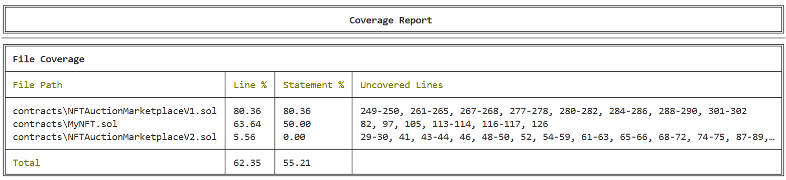

# NFT 拍卖市场项目文档

# 项目说明

## 项目概述

这是一个完整的 Solidity 智能合约项目，实现了一个 NFT 拍卖市场。项目使用 Hardhat 框架开发，支持 ERC721 NFT、Chainlink 预言机价格获取，以及 UUPS 可升级代理模式。

## 项目功能

- 创建拍卖
- 支持用户出价
- 支持撤回资金
- 支持结束拍卖并结算
- 获取实时ETH/USD价格（通过Chainlink）
- UUPS升级机制

## 项目结构

```
solidity-homework3-new2/
├── contracts/                 # Solidity 合约文件
│   ├── metadata.json          # NFT 元数据
│   ├── MyNFT.sol              # ERC721 NFT合约
│   ├── NFTAuctionMarketplaceProxy.sol      # UUPS 代理合约本合约
│   ├── NFTAuctionMarketplaceV1.sol         # NFT 拍卖市场V1版本合约（可升级）
│   └── NFTAuctionMarketplaceV1.sol         # NFT 拍卖市场V2版本合约（可升级）
|
├── scripts/                   # 交互脚本
│   ├── deploy.ts              # 部署脚本
│   └── upgrade.ts             # 升级脚本
|
├── test/                      # 测试脚本
│   └── NFTAuctionMarketplace.ts          # NFT 拍卖市场合约测试脚本
|
├── .gitignore                 # 忽略配置文件
├── README.md                  # 项目文档
├── hardhat.config.ts          # Hardhat 配置文件
├── package-lock.json          # NPM 配置文件
├── package.json               # NPM 配置文件
├── tsconfig.json              # TypeScript 配置文件
└── 需求.md                     # 需求文档
```
# 部署说明

## Sepolia 测试网部署

### Step 1: 环境准备

```bash
# 安装依赖
npm install

# 编译合约
npx hardhat compile

# 验证编译无错误
npx hardhat test
```

### Step 2: 配置环境变量

创建 `.env` 文件：

```env
# Sepolia RPC URL（可以从 Infura、Alchemy 或其他 RPC 提供商获取）
SEPOLIA_RPC_URL=https://sepolia.infura.io/v3/YOUR_INFURA_PROJECT_ID

# 你的私钥（从 MetaMask 或硬件钱包导出）
SEPOLIA_PRIVATE_KEY=your_private_key_without_0x_prefix
```

### Step 3: 部署合约

```bash
# 部署到 Sepolia
npx hardhat run scripts/deploy.ts --network sepolia
```

### Step 4: 保存部署地址

部署完成后，将输出的地址保存到文件或环境变量中：

```bash
# MYNFT_ADDRESS=0x...
# IMPLEMENTATION_ADDRESS=0x...
PROXY_ADDRESS=0x...
# NEW_IMPLEMENTATION_ADDRESS=0x... # 合约升级，前端无感
```

## 验证合约

### 使用 Etherscan 验证

#### Step 1: 配置验证环境

更新 `.env` 文件：

```env
ETHERSCAN_API_KEY=your_etherscan_api_key
```

#### Step 2: 验证合约

```bash
# 验证 MyNFT 合约
npx hardhat verify --network sepolia MYNFT_ADDRESS

# 验证 IMPLEMENTATION_ADDRESS 合约
npx hardhat verify --network sepolia IMPLEMENTATION_ADDRESS

# 验证代理合约（需要初始化数据）
# 对于 UUPS 代理合约，验证时可以不带 initialize 函数的参数，因为 Etherscan 会自动从部署交易中提取这些信息！
npx hardhat verify --network sepolia PROXY_ADDRESS
```

### Step 4: 在 Etherscan 上查看

验证成功后，可以在 Etherscan 上查看合约：
```
https://sepolia.etherscan.io/address/YOUR_ADDRESS
```

## 升级合约

### 升级准备

1. 创建新合约实现（`contracts/NFTAuctionMarketplaceV2.sol`）
2. 编译新版本
3. 运行测试确保无错误

### 执行升级

```bash
# .env文件中配置代理地址
PROXY_ADDRESS=0x...


# 执行升级
npx hardhat run scripts/upgrade.ts --network sepolia
```

### 验证升级

```bash
# 检查代理指向的实现地址
npx hardhat verify NEW_IMPLEMENTATION_ADDRESS --network sepolia
```

# 测试报告（此处仅测试NFTAuctionMarketplaceV1.sol合约）

## 测试覆盖率

```bash
# 运行所有测试并生成覆盖率报告
npx hardhat test --coverage
```



# 部署地址

```bash
# MyNF合约地址
MYNFT_ADDRESS=0xd9f152D840CF921c3292cCEacaf6715B75c31344

# NFTAuctionMarketplaceV1合约地址
IMPLEMENTATION_ADDRESS=0x909aB0BfE602d740344FbCf19F079513CA9F6244

# UUPS代理合约地址
PROXY_ADDRESS=0xd23cAaE4484F858DcC27Aa297589bf1CFBEE4901

# NFTAuctionMarketplaceV2合约地址 - 合约升级，前端无感
NEW_IMPLEMENTATION_ADDRESS=0x4e5174aA92F2AD2bf0F0aB9aAd4Ba0E75c6aFb53
```